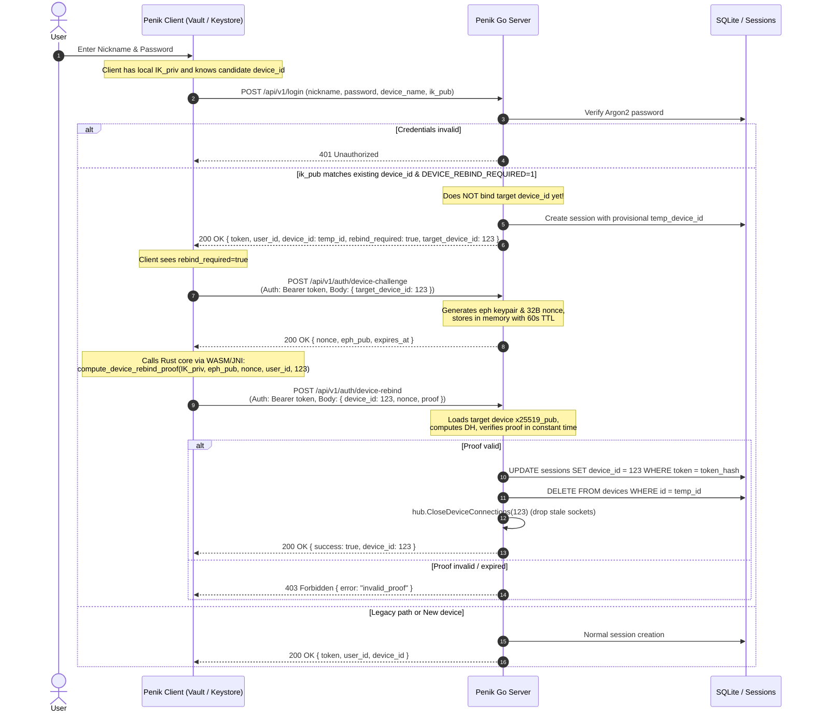

# Plan: Device Identity Key Proof-of-Possession for Session Rebind

## 1. Problem & Context

### 1.1 What Device Binding Is & Why It Exists
In Penik (and modern E2EE architectures like Signal / Matrix):
- Each installation has a unique `device_id` and a permanent X25519 identity key (`x25519_pub`).
- **Multi-device pairwise encryption:** When user Alice sends a message to Bob, Alice encrypts a distinct ciphertext for *every active device* of Bob (`recipient_device_id`), plus for Alice's other devices for synchronization.
- **Group key envelopes:** When a group ratchet rotates, epoch symmetric keys are distributed encrypted to each member's specific `device_id`.
- **Offline delivery:** Pending unread messages and envelopes are stored queued on the server addressing specific `recipient_device_id` targets.
- **Key pinning & TOFU:** Peer clients maintain Trust-On-First-Use (TOFU) pinning for each `(user_id, device_id) -> x25519_pub`.

### 1.2 Why We Need to Rebind to an Existing `device_id`
When a legitimate user logs in again on a device that already ran Penik (for instance, after session expiration, app update, or manual logout):
- The client still possesses the device's private identity key in secure local storage (`IndexedDB` non-extractable vault on Web/Desktop, `AndroidKeyStore` on Android).
- **If we do NOT rebind to the existing `device_id` (i.e. allocate a brand new device row on every login):**
  1. **Zombie Device Explosion:** The user's device count grows indefinitely (`device_id` 1, 2, 3, 4...).
  2. **Wasted Fan-Out:** Every sender in every direct and group chat must encrypt messages for dozens of defunct zombie devices, bloating database and bandwidth.
  3. **Loss of Queued History:** Offline envelopes or group keys addressed to the previous `device_id` while logged out would never be delivered to the new `device_id`.
  4. **False Safety Alarms:** Other contacts' TOFU stores would constantly flag new untrusted devices and ask users to reverify fingerprints.
- Therefore, binding a fresh session back to an existing `device_id` when the local installation still holds that device's identity key is crucial for health and UX.

### 1.3 The Vulnerability in the Legacy Flow
Currently in `server/internal/handlers/auth.go`:
```sql
SELECT d.id FROM devices d
JOIN device_public_keys dpk ON dpk.device_id = d.id
WHERE d.user_id=? AND dpk.x25519_pub=?
```
The server binds a new session to an existing `device_id` simply because the client supplied matching `req.IKPub`. Furthermore, if `IKPub` is omitted or unmatched, it falls back to:
```sql
SELECT id FROM devices WHERE user_id=? AND device_name=?
```
**The Attack Vector:**
1. Public identity keys are public knowledge (readily accessible via `GET /api/v1/keys/bundle?user_id=...` or WS `OpKeyBundleReq` by any user who can chat with the victim).
2. If an attacker obtains the victim's account password (phishing, credential stuffing, password reuse), they can:
   - Call `/login` sending `ik_pub` = victim's public key (or victim's `device_name`).
   - The server assigns `sessions.device_id = victim_device_id` **without asking for proof of private key possession**.
   - The attacker receives all pending offline direct messages and group key distribution envelopes intended for that device.
   - The attacker can overwrite public keys via `/keys/init` or WS `OpKeyPublish`.
   - The attacker disconnects the victim's live WebSocket connection.

---

## 2. Cryptographic Proof-of-Possession Design (A2 — X25519 DH-Challenge)

X25519 keys are Diffie-Hellman scalar multiplication keys, not Ed25519 signature keys. Proof of possession is established via an ephemeral Zero-Knowledge / Diffie-Hellman challenge:

```
Server                                              Client (possessing IK_priv)
  |                                                              |
  |  Generate eph_priv, eph_pub (X25519)                         |
  |  Generate nonce (32 random bytes)                            |
  | ----------------- { nonce, eph_pub } ----------------------> |
  |                                                              |
  |                                              shared = DH(IK_priv, eph_pub)
  |                                              proof  = HKDF-SHA256(
  |                                                         ikm  = shared,
  |                                                         salt = "",
  |                                                         info = framing,
  |                                                         len  = 32
  |                                                       )
  | <---------------- { device_id, nonce, proof } -------------- |
  |                                                              |
  |  shared = DH(eph_priv, x25519_pub)                           |
  |  expected_proof = HKDF-SHA256(...)                           |
  |  ConstantTimeCompare(proof, expected_proof)                  |
  |  Consume nonce                                               |
  v                                                              v
```

### 2.1 Info Framing Specification (Deterministic 69-Byte Binary Wire Format)
To eliminate any cross-platform string formatting or delimiter injection vulnerabilities, HKDF `info` is defined as a fixed-length binary byte array:

| Offset | Length | Type | Description |
|---|---|---|---|
| 0..20 | 21 B | ASCII | Context label: `"penik-device-rebind-v1"` |
| 21..52 | 32 B | Raw bytes | Ephemeral random `nonce` |
| 53..60 | 8 B | uint64 BE | `user_id` (Big-Endian unsigned 64-bit integer) |
| 61..68 | 8 B | uint64 BE | Target `device_id` (Big-Endian unsigned 64-bit integer) |

Total length: exactly **69 bytes**.

---

## 3. Protocol Flow (Solving the Bearer Chicken-and-Egg Issue)

To avoid authorization deadlocks where an unauthenticated or 403-rejected client cannot call authenticated challenge endpoints, we use the **Session-First Rebind** pattern.



### 3.1 Endpoints Specification

#### 1. `POST /api/v1/auth/device-challenge`
- **Auth:** `Bearer <token>` (active session for `user_id`)
- **Body:** `{ "target_device_id": 123 }`
- **Validation:**
  - Verify `target_device_id` belongs to `ctx.UserID`.
  - Rate limit: max 5 requests / minute per user.
- **Server Action:**
  - Generate ephemeral X25519 keypair `(eph_priv, eph_pub)` using `crypto/rand`.
  - Generate 32-byte cryptographically secure random `nonce`.
  - Store `{ nonce, eph_priv, user_id, target_device_id, expires_at: now + 60s }` in an in-memory TTL store.
- **Response:**
  ```json
  {
    "nonce": "<base64>",
    "eph_pub": "<base64>",
    "expires_at": 1740000060
  }
  ```

#### 2. `POST /api/v1/auth/device-rebind`
- **Auth:** `Bearer <token>`
- **Body:**
  ```json
  {
    "device_id": 123,
    "nonce": "<base64>",
    "proof": "<base64>"
  }
  ```
- **Server Action:**
  - Lookup challenge by `nonce` in in-memory store.
  - **CRITICAL:** Atomically delete challenge from memory immediately (single-use nonce; no retry on failed verification).
  - Verify challenge has not expired, and `challenge.user_id == ctx.UserID` and `challenge.target_device_id == req.DeviceID`.
  - Fetch `x25519_pub` from `device_public_keys` for `req.DeviceID`.
  - Check non-contributory point: compute `shared = X25519(eph_priv, x25519_pub)`. Reject if error or all zeros.
  - Derive expected proof: `HKDF-SHA256(ikm: shared, salt: nil, info: 69-byte binary info, length: 32)`.
  - `subtle.ConstantTimeCompare(proof, expected_proof) == 1`.
  - On match:
    - Update `sessions.device_id = req.DeviceID` for caller's token.
    - If current session had a provisional device (`temp_device_id`), delete the provisional row from `devices`.
    - Terminate existing WebSocket connections associated with `req.DeviceID` or older revoked tokens via `hub.CloseDeviceConnections(123)`.
- **Response:**
  ```json
  {
    "success": true,
    "device_id": 123
  }
  ```

---

## 4. Hardening & Security Gates

| Surface | Rule | Description |
|---|---|---|
| **`device_name` Fallback in Login** | **Permanent Removal** | In `server/internal/handlers/auth.go`, completely delete `SELECT id FROM devices WHERE user_id=? AND device_name=?`. Devices must never be claimed by name. |
| **`POST /keys/init` & WS `OpKeyPublish`** | **Immutable Identity Key** | If `device_public_keys` already contains a row for `ctx.DeviceID` and the incoming `x25519_pub` does not match, return `409 Conflict`. A device cannot mutate its identity key; key rotation requires creating a new device. |
| **Nonce Single-Use** | **Immediate Eviction** | In-memory challenge store drops entry on verification attempt (successful or not) to block replay and brute-force attacks. |
| **Feature Flag** | `DEVICE_REBIND_REQUIRED` | `0` = server issues challenge if requested, but allows legacy bind if client doesn't rebind.<br/>`1` = enforced in production. |

---

## 5. Unified Crypto Core Implementation (Rust Core Only)

Per **Rule 5 (Crypto Development Policy)**:
> JavaScript and Kotlin crypto implementations are strictly frozen. All new cryptographic operations MUST be implemented in `rust/penik-crypto`.

### 5.1 Rust Micro-Core (`rust/penik-crypto`)
- Implement `compute_device_rebind_proof` in `rust/penik-crypto/src/keys.rs` (or new `auth.rs`):
  ```rust
  pub fn compute_device_rebind_proof(
      ik_priv: &[u8],
      eph_pub: &[u8],
      nonce: &[u8],
      user_id: u64,
      device_id: u64,
  ) -> Result<[u8; 32], CryptoError> {
      if nonce.len() != 32 {
          return Err(CryptoError::InvalidLength);
      }
      // diffie_hellman checks shared.was_contributory()
      let shared = diffie_hellman(ik_priv, eph_pub)?;
      
      let mut info = Vec::with_capacity(69);
      info.extend_from_slice(b"penik-device-rebind-v1");
      info.extend_from_slice(nonce);
      info.extend_from_slice(&user_id.to_be_bytes());
      info.extend_from_slice(&device_id.to_be_bytes());

      let okm = kdf::hkdf_derive(&[], &shared, &info, 32)?;
      let mut proof = [0u8; 32];
      proof.copy_from_slice(&okm);
      Ok(proof)
  }
  ```
- **WebAssembly export:** `wasm_compute_device_rebind_proof(ik_priv, eph_pub, nonce, user_id, device_id)` in `rust/penik-crypto/src/wasm.rs`.
- **JNI export:** `Java_niel_kro_penik_data_crypto_RustCryptoCore_computeDeviceRebindProof` in `rust/penik-crypto/src/jni.rs`.
- **C-ABI export:** `penik_compute_device_rebind_proof` in `rust/penik-crypto/src/c_abi.rs` for Python test suite.

---

## 6. Implementation Breakdown

### 6.1 Phase 1: Rust Core (`rust/penik-crypto`)
1. Implement `compute_device_rebind_proof` with unit tests covering valid input, low-order point rejection, invalid nonce lengths.
2. Bind WASM, JNI, and C-ABI exports.
3. Build artifacts via `scripts/build_rust.sh`.

### 6.2 Phase 2: Go Backend (`server/`)
1. Add in-memory TTL challenge store with mutex and background ticker cleanup in `server/internal/handlers/challenge_store.go`.
2. Add `POST /api/v1/auth/device-challenge` and `POST /api/v1/auth/device-rebind` in `server/internal/handlers/device_rebind.go`.
3. Update `server/internal/handlers/auth.go`:
   - Delete `device_name` lookup fallback.
   - If `ik_pub` matches existing device and `DEVICE_REBIND_REQUIRED=1`, create provisional session with `rebind_required: true`.
4. Update `server/internal/handlers/keys.go` and `server/internal/ws/client.go`:
   - Reject identity key updates if `x25519_pub` already set and differs (`409 Conflict`).

### 6.3 Phase 3: Web & Desktop Clients (`client/`)
1. Update `client/js/api.js`: add `deviceChallenge(targetDeviceId)` and `deviceRebind(deviceId, nonce, proof)`.
2. Update `client/js/ui/auth.js`:
   - Upon receiving `rebind_required: true` from `/login`, read local `IK_priv` from `vault`.
   - Call `api.deviceChallenge(target_device_id)`.
   - Call WASM `wasm_compute_device_rebind_proof`.
   - Call `api.deviceRebind(...)`.
   - Update local stored `device_id` and proceed to chat screen.

### 6.4 Phase 4: Android Client (`android/`)
1. Add `computeDeviceRebindProof` to `RustCryptoCore.kt`.
2. Update `AuthRepository.kt` login flow: if `rebind_required`, fetch challenge, execute proof via JNI, send rebind request.
3. Verify Android compilation: `bash ./gradlew compileDebugKotlin`.

### 6.5 Phase 5: Verification & E2E Testing
1. Direct Python crypto verification in `tests/e2e/test_crypto_core.py` (validate Rust C-ABI vs Python `cryptography` library).
2. E2E tests in `tests/e2e/test_runner.py`:
   - Claim device without proof -> returns 403 on rebind; history/envelopes isolated.
   - Rebind with valid proof -> session elevated, offline messages and envelopes received.
   - Nonce replay test -> second rebind attempt fails immediately.
   - Wrong identity key test -> rebind rejected.
   - Key overwrite attempt in `keys/init` / `OpKeyPublish` -> rejected with 409.

---

## 7. Rollout Plan

1. Deploy Phase 1 & 2 behind `DEVICE_REBIND_REQUIRED=0` on server.
2. Deploy Web and Android client updates (auto-rebind enabled).
3. Verify telemetry and E2E test runs on staging / local (`127.0.0.1:8143`).
4. Set `DEVICE_REBIND_REQUIRED=1` on production server.
